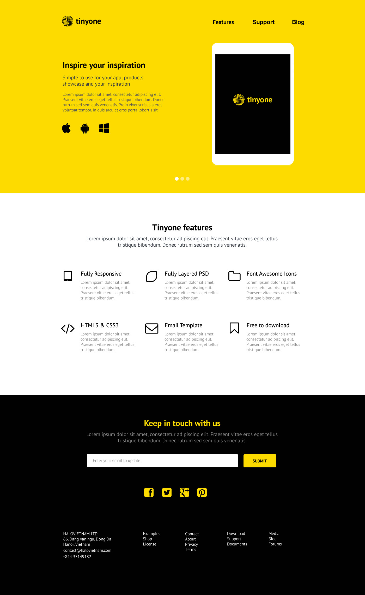
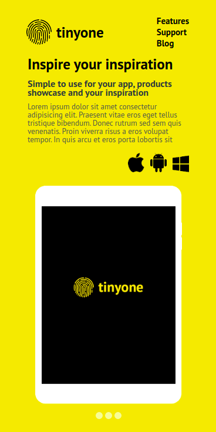
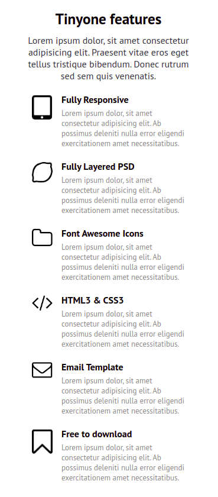
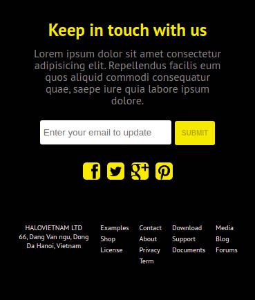
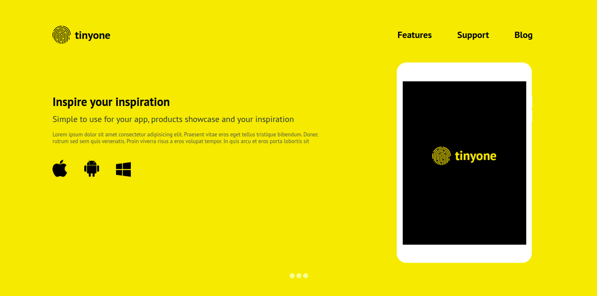
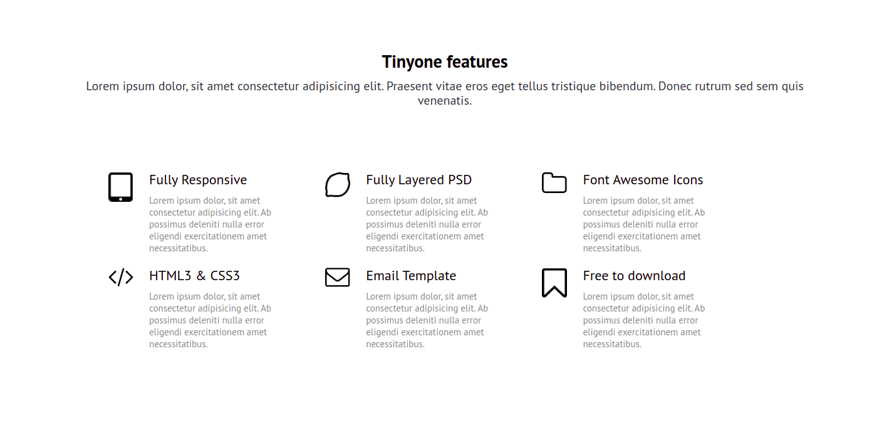
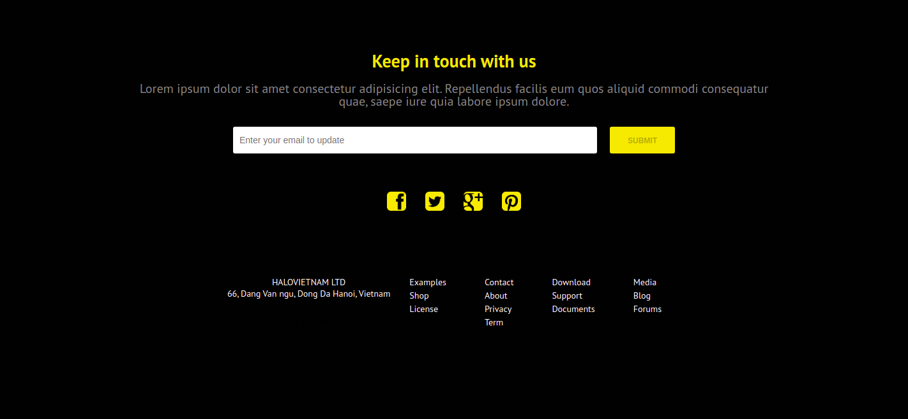

</p>
<h1 
  align="center"
  style="color: rgba(252, 219, 0, 1)"
>
    
    &nbsp;Tinyone
</h1>

<p align="center">
 <a href="#-sobre-o-projeto">Sobre</a> •
 <a href="#-funcionalidades">Funcionalidades</a> •
 <a href="#-layout">Layout</a> • 
 <a href="#-como-executar-o-projeto">Como executar</a> • 
 <a href="#-tecnologias">Tecnologias</a> •
 <a href="# -como-contribuir">Como contribuir</a> •
 <a href="#-autor">Autor</a> • 
 <a href="#-licença">Licença</a>
</p>

<h2 align="center">
  <u>Acese o App no link abaixo para testar!</u>
  <br><a style="font-size: 25px; " href="https://stefano-branz-front-end.vercel.app/">
    Tinyone
  </a>
</h2>

## 💻 Sobre o projeto

<div id="-sobre-o-projeto">

Tinyone - Esse é um projeto desenvolvido para a etapa de teste da vaga de Front End para a **[2B Digital](https://www.agencia2bdigital.com.br/), by Totvs Ibirapuera**.

A ideia do teste foi recriar uma página estática responsiva a partir de um layout fornecido pela **2B Digital**.

O layout fornecido foi de uma página em versão desktop.

---

## ⚙️ Funcionalidades

<div id="-funcionalidades">

- [x] Criar App com conceito **Mobile First**.
- [x] Página estática nos moldes apresentados pelo layout disponibilizado:
  - [x] Header com Logo à esquerda e menu à direita.
    - [x] Menu funcional redirecionando para determinada área do site ao clicar.
  - [x] Main page dividido em três partes:
    - [x] Blog section:
      - [x] Implementação Flexible box.
      - [x] Ícones Apple, Android e Windows. Redirecionam para as respectivas stores ao clique.
    - [x] Features section:
      - [x] Implementação Flexible box em todas as versões alterando número de colunas de acordo com tamanho da tela.
    - [x] Support section:
      - [x] Input para inserção de email com **Regex** funcional.
      - [x] Button submit habilitado apenas ao inserir email válido.
      - [x] Ao clicar em submit, campo do input é resetado.
      - [x] Ícones para redes sociais **Facebook**, **Twitter**, **Google** e **Pinterest**.
      - [x] Footer com link para enviar email e telefone de contato funcionais.
      - [x] Links para outras páginas.

---

## 🎨 Layout

<div id="-layout">

### O layout disponibilizado pela **2B Digital** :

  
  
&nbsp;

### <u> Mobile Layout</u>:

**Blog Part :**

  

**Features Part :**

  

**Support Part :**

  

&nbsp;

### <u> Desktop Layout</u>:

**Blog Part :**

  

**Features Part :**

  

**Support Part :**

  

---

## 🚀 Como executar o projeto

<div id="-como-executar-o-projeto">

Antes de rodar o projeto é preciso instalar algumas ferramentas. Caso você já tenha instalado pode pular a etapa de pré-requisitos.

### <u>Pré-requisitos</u>:

Antes de começar, é preciso ter instalado as seguintes ferramentas:

- Editor de códigos:

  [VSCode](https://code.visualstudio.com/)

- Ferramenta de versionamento de código:

  [GIT](https://git-scm.com)

- Manipulador de pacotes:

  [NPM](https://www.npmjs.com/)

### <u>Rodar a aplicação</u>:

&nbsp;

```bash

# Abra seu terminal e digite para abrir o VSCode
  code

# Abra a pasta onde vai ficar o projeto
# Clone este repositório
$ git clone https://github.com/Stefano020/2bdigital-teste-front-end

# Acesse a pasta do projeto no seu terminal/cmd
$ cd 2bdigital-teste-front-end

# Instale as dependências
$ npm install

# Execute a aplicação em modo de desenvolvimento
$ npm run start

# A aplicação será aberta na porta:3000 - acesse http://localhost:3000

```

---

## 🛠 Tecnologias

<div id="-tecnologias">

As seguintes ferramentas foram usadas na construção do projeto:

#### **Website** ( + )

- **[React](https://reactjs.org/)**
  - **[Hooks](https://reactjs.org/docs/hooks-intro.html)**
- **[JavaScript](https://www.javascript.com/)**
- **[Sass](https://sass-lang.com/)**
  - **[SCSS Syntax](https://sass-lang.com/documentation/syntax)**

> Veja o arquivo [package.json](https://github.com/tgmarinho/README-ecoleta/blob/master/web/package.json)

## 💪 Como contribuir para o projeto

<div id="-como-contribuir">

1. Faça um **fork** do projeto.
2. Crie uma nova branch com as suas alterações: `git checkout -b my-feature`
3. Salve as alterações e crie uma mensagem de commit contando o que você fez: `git commit -m "feature: My new feature"`
4. Envie as suas alterações: `git push -u origin my-feature`
   > Caso tenha alguma dúvida confira este [guia de como contribuir no GitHub](./CONTRIBUTING.md)

---

## 🦸 Autor

<div id="-autor">

  <a href="https://github.com/Stefano020">
    
    <br />
    <sub><b style="font-size: 15px;">Stefano Branz</b></sub>
  </a>🚀

  <br />
  <br />

[](https://www.linkedin.com/in/stefano-branz/)
[](mailto:stefano.branz@gmail.com)

---

## 📝 Licença

<div id="#-licença">

Este projeto esta sobe a licença [MIT]("./LICENSE").

Feito por **Stefano Branz** [Entre em contato!](https://www.linkedin.com/in/stefano-branz/)
